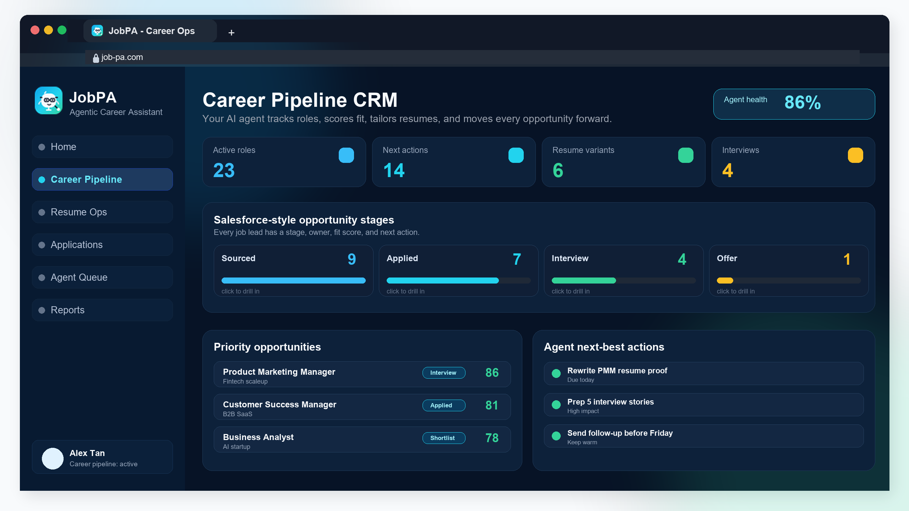

# JobPA

**Agentic AI Career Ops for job seekers.**

JobPA helps candidates track, tailor, and improve every job application with a Career Ops dashboard and an AI Career Assistant. It is built for international job seekers managing multiple roles, markets, resumes, follow-ups, and interview stages.

[Live demo](https://job-pa.com) · [Dashboard preview](https://job-pa.com/dashboard-preview) · [Career Ops page](https://job-pa.com/career-ops)



## The Product

JobPA is intentionally packaged as two products:

| Product | What it does |
| --- | --- |
| **Career Ops Dashboard** | Tracks applications, role fit, resume gaps, follow-ups, interview prep, and next-best actions in one operating view. |
| **AI Career Assistant** | Answers career questions, explains strategy, helps with resume/interview positioning, and routes high-stakes moments to consulting. |

Resume analysis, job fit scoring, interview prep, reports, email support, and consulting are modules inside this workflow, not separate products.

## Why It Exists

Most job seekers do not need another job board. They need operational support:

- Which roles are worth applying to?
- Is this role realistic for my background, visa situation, and target salary?
- How should I tailor my resume for this job description?
- What should I prepare before the interview?
- What is the next action in my application pipeline?

JobPA turns those repeated decisions into an agent-assisted workflow while keeping the candidate in control.

## Positioning

JobPA is **not** recruiter software and **not** an auto-apply bot.

- Candidate-side Career Ops, not enterprise ATS or sourcing CRM.
- Human-in-the-loop guidance, not blind mass applying.
- AI support for fit, tailoring, prep, and follow-up.
- Paid consulting path for resume, interview, visa, and career strategy support.

## B2B Page

JobPA also has a lightweight company page for partners:

[JobPA for Companies](https://job-pa.com/companies)

The B2B angle is candidate success infrastructure for universities, bootcamps, communities, and employers that want candidates to become application-ready. It is not positioned as a recruiting marketplace.

## Core Modules

- Application tracking
- Resume parsing and analysis
- Job fit evaluation
- AI career chat
- Interview preparation
- Career Ops scans
- Market and role SEO playbooks
- Consulting conversion flow
- Dark and light mode

## Tech Stack

- React 19
- Vite
- TypeScript
- Tailwind CSS 4
- shadcn/ui
- tRPC
- Express
- Drizzle ORM
- MySQL/TiDB
- Vitest
- Vercel

## Local Setup

```bash
pnpm install
cp .env.example .env
pnpm run db:push
pnpm run seed:demo
pnpm run dev
```

The server selects an available local port starting at `3000`.

## Environment Variables

Copy `.env.example` to `.env` and configure local values. Do not commit `.env`.

Required for a full local run:

```bash
DATABASE_URL=
JWT_SECRET=
APP_BASE_URL=http://localhost:3000
GOOGLE_CLIENT_ID=
GOOGLE_CLIENT_SECRET=
GOOGLE_REDIRECT_URI=http://localhost:3000/api/auth/google/callback
GOOGLE_GMAIL_REDIRECT_URI=http://localhost:3000/api/integrations/gmail/callback
LLM_BASE_URL=
LLM_API_KEY=
LLM_MODEL=
```

## Development Commands

```bash
pnpm run dev
pnpm run check
pnpm test
pnpm run build
```

## Repository Structure

```text
client/      React frontend
server/      Express, tRPC, auth, AI, and integrations
shared/      Shared schemas and i18n
drizzle/     Database schema and migrations
api/         Vercel API entrypoint
scripts/     Demo seed and helper scripts
docs/        Launch assets and QA notes
```

## Safety Policy

JobPA is guidance software.

- No automatic job submissions.
- No credential collection for third-party job boards.
- No bypassing job-board logins or terms.
- AI outputs must be verified for visa, salary, employment, immigration, tax, and legal decisions.

## Launch Checklist

- [x] Public dashboard preview
- [x] Custom domain: [job-pa.com](https://job-pa.com)
- [x] SEO pages for roles and industries
- [x] B2B company page
- [ ] Short demo GIF or video
- [ ] Product Hunt launch copy
- [ ] GitHub issue templates
- [ ] Contribution guide

## Founder

Built by Sumin Lee for international talent navigating Singapore-first cross-border careers.

- Website: [job-pa.com](https://job-pa.com)
- LinkedIn: [linkedin.com/in/suminlee-apac](https://linkedin.com/in/suminlee-apac)

## License

MIT
